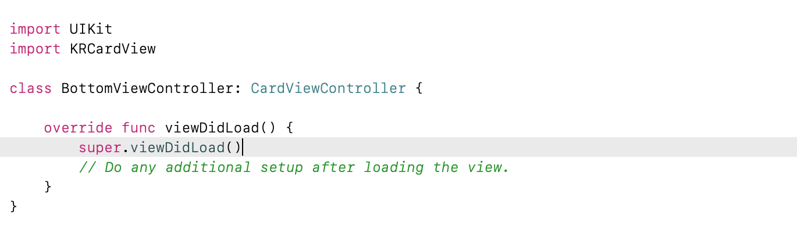
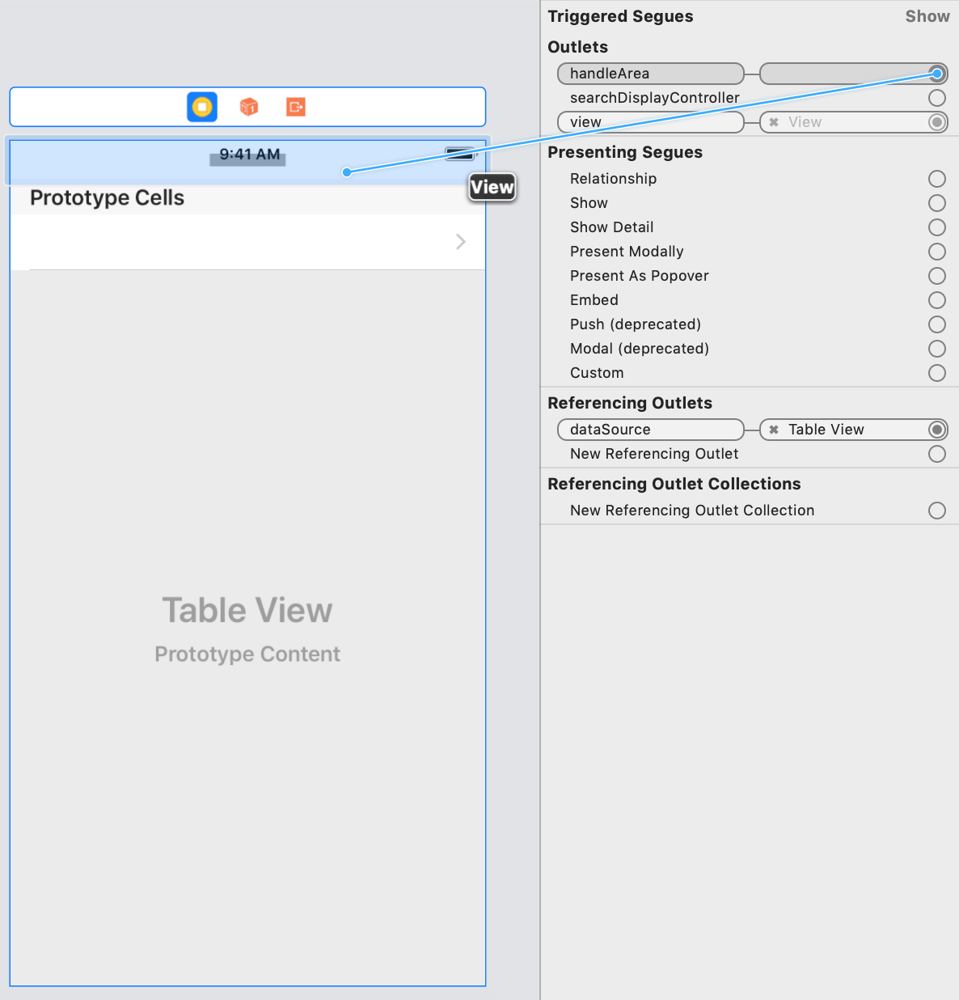
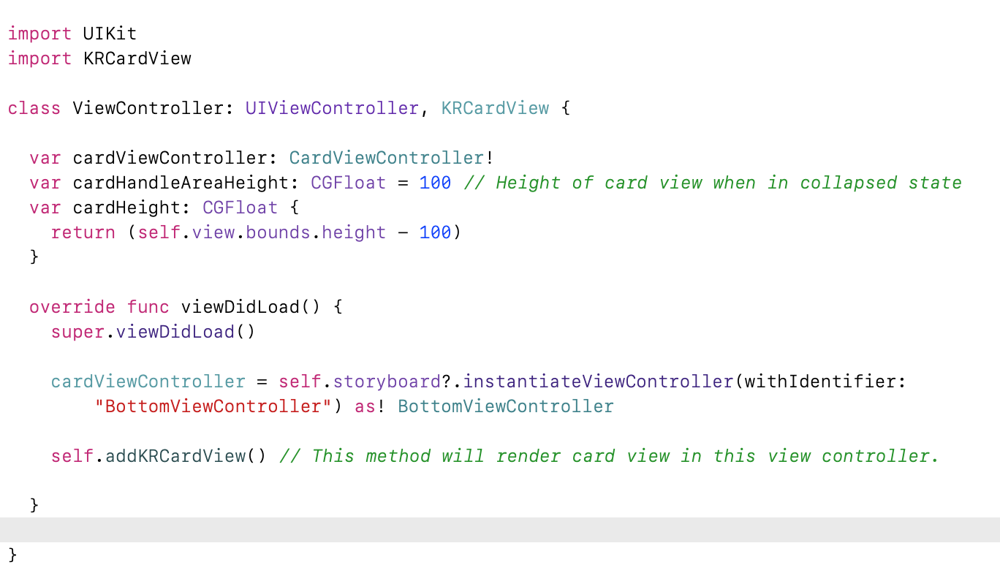

# KRCardView

[](https://travis-ci.org/kamalraj.venkatesan/KRCardView)
[](https://cocoapods.org/pods/KRCardView)
[](https://cocoapods.org/pods/KRCardView)
[](https://cocoapods.org/pods/KRCardView)

## Preview


## Example

To run the example project, clone the repo, and run `pod install` from the Example directory first.

## Usage

1. Create a subclass of CardViewController (Refer below image)


2. Go to storyboard and add a new UIViewController and now add class name (BottomViewController) in Identity Inspector.
3. In same viewcontroller add a view on top of root view and connect it to handleView Outlet (Refer Below Image)


4. Now go to main view controller where you need card view in bottom.
5. Import KRCardView (Refer below image).
6. Add KRCardView protocol to main view controller (Refer below image).
7. Now initialize cardHandleAreaHeight and cardHeight variables (Refer below image).
6. Assign bottom view controller to cardViewController variable (Refer below image).
7. Finally call addKRCardViewMethod in ViewDidLoad (Refer below image).


8. That's it.

## Requirements

## Installation

KRCardView is available through [CocoaPods](https://cocoapods.org). To install
it, simply add the following line to your Podfile:

```ruby
pod 'KRCardView'
```

## Author

kamalraj venkatesan, reach.kamalraj@outlook.com

## License

KRCardView is available under the MIT license. See the LICENSE file for more info.
